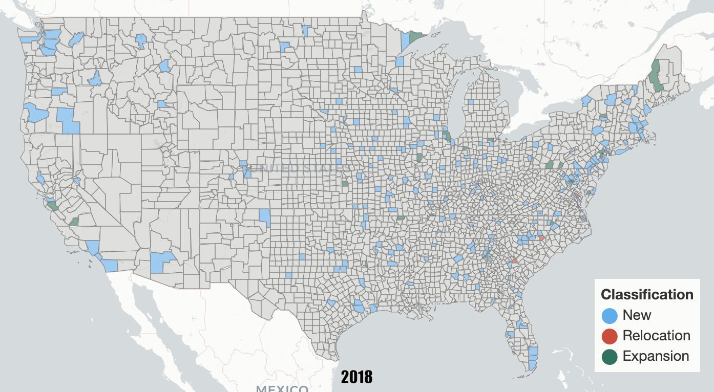
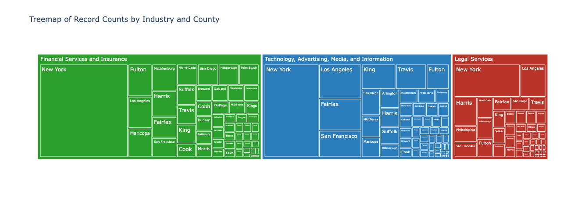

# Duke-Datafest2025

Team TLDR | ASA DataFest @ Duke University 2025  
**Contributors**: Thomas You, Kevin Tao, Jason Deng, Sophia Shen, Lucy Wang

## Project Summary

**Where should I locate my new office?**  
Our project addresses this critical real estate decision using a combination of leasing transaction data, geospatial visualization, and machine learning. By analyzing leasing activity across US counties and industries, we built a model to support informed site selection—highlighting fast-growing sectors and evaluating top leasing factors across space, time, and location.

## Project Structure

```
├── AddressConvertionTool/          # Tools for converting address-level data
├── ASA-Duke-Datafest...PDF         # DataFest prompt and analysis guide
├── Dataset/                        # Cleaned transactional datasets
├── GeoCoding Supporting Files/     # US county list and geocoding support
├── Geocoded Data/                  # County-level geocoded outputs
├── TemporalMapGifs/                # Animated gifs visualizing growth
├── Visualizations/                 # Static charts and spatial plots
├── county_scores/                  # County-based scoring results
├── .idea, .DS_Store                # IDE configs (safe to ignore)
├── DataFest 2025.pptx              # Final project presentation
├── DotPng.ipynb                    # Industry vs Rent analysis
├── MainLab_EDA.ipynb               # Exploratory Data Analysis notebook
├── MainLab_correlation.ipynb       # Correlation analysis
├── MainModel_Industry.ipynb        # Main predictive model notebook
├── MainModel_Transaction.ipynb     # Transaction type classification model
```

## Methodology Highlights

- Temporal Analysis: Identified growing industries by year and county using animated maps and treemaps.
- Feature Engineering: Extracted top 10 features impacting leasing decision (e.g., rent, space, availability).
- Modeling: Developed a Decision Tree classifier with an accuracy of 92.5% for lease type prediction.
- Key Insight: Miami-Dade County is a hotspot for financial services, with high leasing activity and strong rental growth.

## Tools Used

- Python (Pandas, Scikit-learn, Plotly, Folium)
- Jupyter Notebooks
- Geopy + US Census Geodata
- PowerPoint (final deliverable)

## Visual Highlights

### Animated Growth of Leasing Activity in Each County


### Treemap of Leasing Activity Based on Industries


### Random Forest Model Used for Classification


## Recognition

Best Visualization Award at ASA DataFest 2025, hosted by Duke University.

## License

This repository is intended for academic demonstration and is not currently licensed for commercial use.
